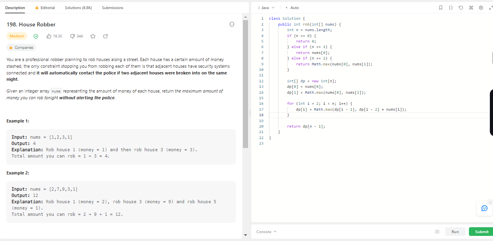
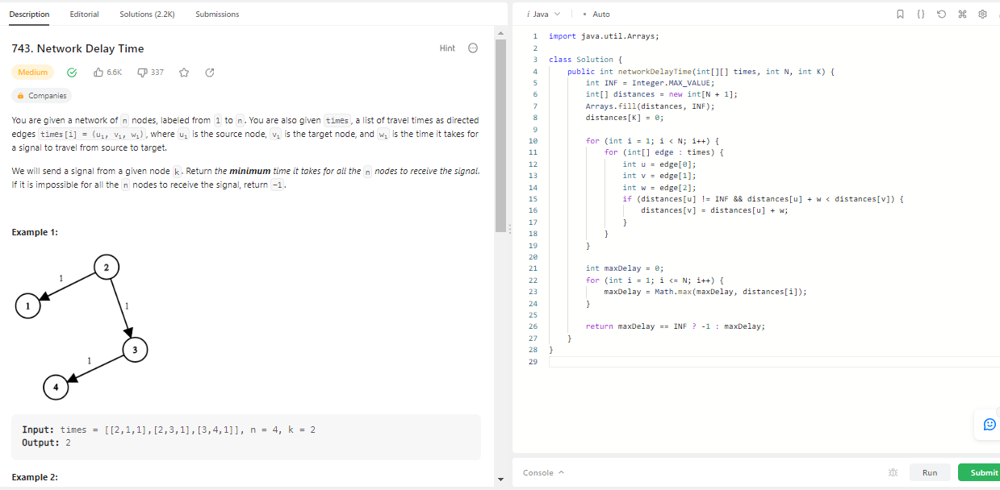
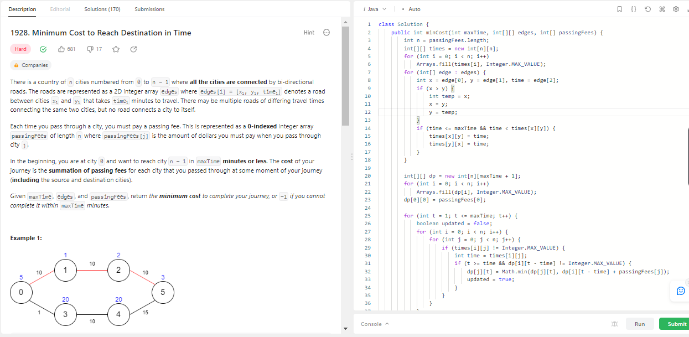

# Exercícios Prgramação Dinâmica

**Número da Lista**: 16 
**Conteúdo da Disciplina**: PD 

## Alunos
|Matrícula | Aluno |
| -- | -- |
| 19/0086131  |  Davi Ranieri Fonsêca |
| 19/0094478  |  Pedro Henrique Nogueira Bragança |

## Sobre 
Resolução de exercícios do assunto Programação Dinâmica do [leetcode](https://leetcode.com/)

## Screenshots
### Exercicio 1 (Difícil) - [Maximal Rectangle](https://leetcode.com/problems/maximal-rectangle/description/) - [CÓDIGO](MaximalRectangle/MaximalRectangle.js)

### Exercicio 2 (Médio) - [WordBreak](https://leetcode.com/problems/word-break/) - [CÓDIGO](WordBreak/WordBreak.js)

### Exercício 3 (Médio) - [Longest Increasing Subsequence](https://leetcode.com/problems/longest-increasing-subsequence/description/) - [CÓDIGO](LongestSubsequence/LongestSubsequence.js)

### Exercício 4 (Médio) - [House Robber](https://leetcode.com/problems/house-robber/description/) - [CÓDIGO](HouseRobber/HouseRobber.java)

### Exercício 5 (Médio) - [Network Delay Time](https://leetcode.com/problems/network-delay-time/description/) - [CÓDIGO](NetworkDelayTime/NetworkDelayTime.java)

### Exercício 6 (Difícil) - [Minimum Cost to Reach Destination in Time](https://leetcode.com/problems/minimum-cost-to-reach-destination-in-time/description/) - [CÓDIGO](CheapestFlightsWithinKStops/CheapestFlightsWithinKStops.java)

## Instalação 
**Linguagem**: JavaScript / Java 
Para testar os códigos, clone o repositório e, com o auxílio da descrição de cada um dos problemas no link do leetcode
